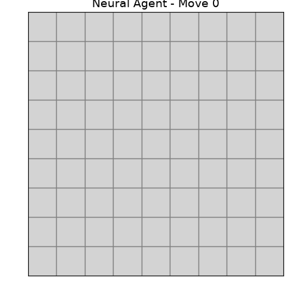
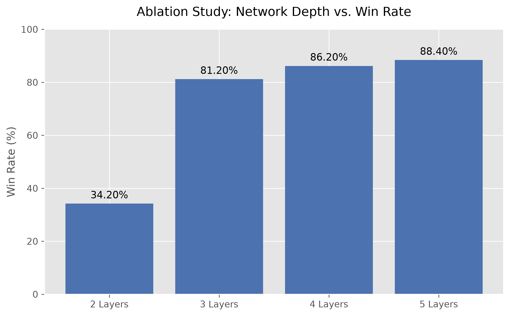
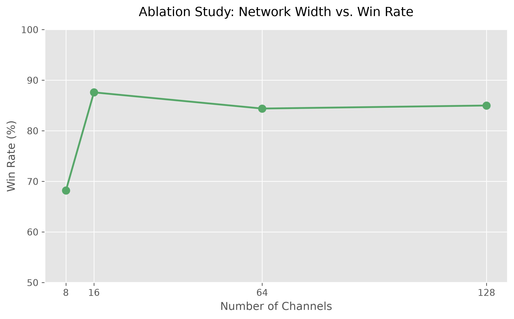
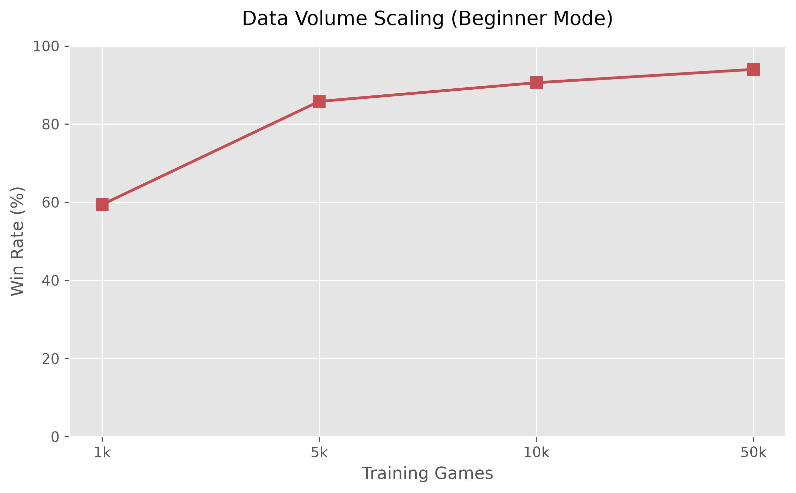
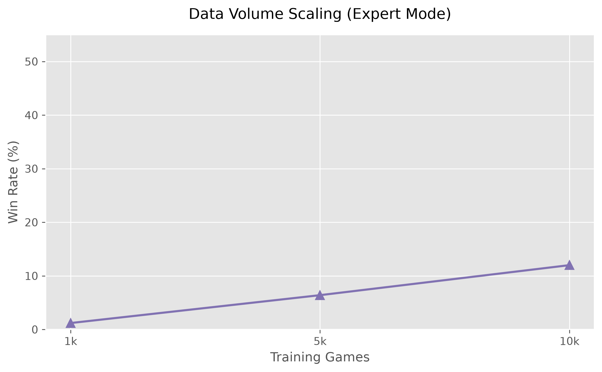

# Minesweeper AI: Convolutional Neural Network

A deep learning project implementing a PyTorch-based Convolutional Neural Network (CNN) that achieves a near-optimal **94% win rate** on Beginner Minesweeper after 50,000 games of training data. 

## Visual Demo



## The Challenge

Minesweeper is a heavily logic-based game, but it frequently forces probabilistic guessing. It has an exponential state space and is classified as NP-complete. 

For a machine learning model to succeed, it cannot merely memorize board states. It must learn the underlying rules of the game (e.g., corners, chording logic, boundary patterns) and calculate the mathematical probabilities of hidden mines when absolute certainty is impossible. This project explores how well a pure CNN can approximate these statistical rules without hardcoded logic.

## Architecture

The agent evaluates the board using a Convolutional Neural Network designed to handle spatial logic.

* **Input Representation:** The board is fed into the network as a $10 \times H \times W$ one-hot encoded tensor (representing hidden cells, safe cells, and the numbers 1-8).
* **Receptive Field:** The network uses $3 \times 3$ convolutional kernels. A 4-layer depth yields a $9 \times 9$ receptive field, allowing the network to view the entirety of a Beginner board at once.
* **Output:** The network outputs a 2D probability map highlighting the single safest coordinate to click next.

## Ablation Studies & Metrics

To ensure the architecture was mathematically optimized, several ablation tests were conducted to track performance against network depth, channel width, and training volume.

### 1. Receptive Field Limits (Depth)
Increasing the network depth expands its receptive field, allowing it to chain logic across longer distances. The model plateaus at 4 to 5 layers, which perfectly covers the $9 \times 9$ Beginner board.



### 2. Information Bottleneck & Overfitting (Width)
Testing channel width revealed a clear overfitting threshold. While 128 channels achieved the lowest validation loss during training, it failed to generalize to unseen board states. The 16-channel and 64-channel variants proved far more robust.



### 3. Data Volume Scaling
The model's performance was mapped against training volume across both Beginner ($9 \times 9$, 10 mines) and Expert ($30 \times 16$, 99 mines) difficulties.

**Beginner Mode:** Reaches the theoretical win-rate ceiling of ~94% (accounting for forced guesses) at 50,000 games.


**Expert Mode:** Highlighting the difficulty of scaling. At 5,000 games, the model achieves a 6.4% win rate. Expert mode requires chains of logic that extend beyond the network's current $9 \times 9$ field of vision, forcing it into 50/50 guesses and indicating a need for deeper layers (8+) to scale effectively.


## Reproducibility

To test the agent or recreate the experiments, clone this repository and install the dependencies.

```bash
# 1. Install dependencies
pip install -r requirements.txt

# 2. Watch the AI play a game in your terminal
python play.py

# 3. Generate a new dataset of 10,000 games
python -m scripts.generate_data --games 10000 --mode beginner

# 4. Train a new model from scratch
python -m scripts.train --epochs 10